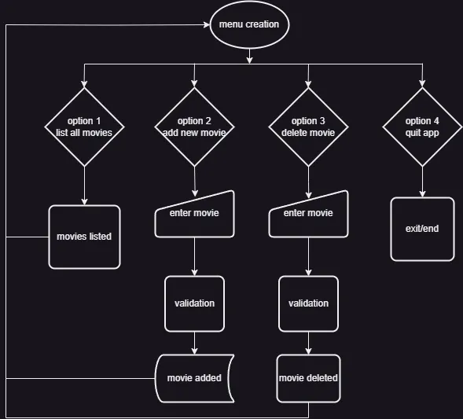

# DVD Collector
Command-line Python application that allows user to create private list of records for DVD movie collection.

## Purpose
Application is providing value to users creating an environment to organize private movie collections simply.  
https://dvd-collector-a3ca4dc586a0.herokuapp.com/

## Data Model

The Data Model serves as the conceptual framework that outlines the organization and representation of data within the application.  
For a simple movie cataloging app, we can consider that movie is the basic entitie.  
Data Structures are the concrete implementations of how data will be stored in memory.  
In this Python app data is stored, organized and manipulated through API in Google Drive Worksheet.

## Target audience

A straightforward Python application for cataloging movies could cater to various demographics, contingent upon its features and capabilities. The following are some possible target audiences:

- Cinephiles: Those who have a passion for films and seek to organize their personal collections effectively.
- Film scholars or researchers: Individuals engaged in film studies who require a method to track the movies they have viewed or wish to analyze.
- Small movie rental enterprises: Businesses that require a fundamental system for managing their inventory.
- Amateur programmers: Individuals interested in learning Python while developing a functional application.

### Flowchart

## Features

- Menu with choices
- Listing of all records from file
- Creating new record
- Saving input data in cloud (Google Docs API)
- Removing record from list
- User input Error handling
- Exiting the app
- Warning in the case of wrong input
- Terminal access (Deployment on Heroku)

### Future Features

- Extended data recording (more input options)
- Structured listing of all records
- Global statistics of the collection
- Listing only by group (title, year, genre)

## Testing

### Manual Testing

Inspection of the code locally was done with the help of VS Code extensions:
- Autopep8 to format the code properly 
- Writen code adheres to Python best practices, such as using consistent indentation.
- Flake8 to check for errors

Test of small chunks of the code with:
- [Online Python Compiler](https://www.tutorialspoint.com/online_python_compiler.php)   
- [Code Institute Python Linter](https://pep8ci.herokuapp.com/#)  
Manual testing of every step accomplished through Gitpod and VS Code terminal with print() function.

### Validator Testing

Pep8, CI Python Linter: https://pep8ci.herokuapp.com/

### Bugs and Issues

Main issues were with deployment steps on Heroku server.

## Deployment
Step-by-step instructions how to install, setup and use the app on:  
https://dvd-collector-a3ca4dc586a0.herokuapp.com/

1. Created Google worksheet for the project on private account
2. Enabled Credentials for access to worksheet over API

3. Create project on Google Cloud

4. Create project on Heroku
5. Transfer Google credentials on Heroku
6. Deploy project on Heroku

## Technologies

Python

## Credits [Acknowledgments]

I want to thank Rory for the invaluable guidance and support throughout the mentorship on this project.  
The Love Sandwiches walkthrough was incredibly helpful. The step-by-step guidance made the learning process much easier to follow.  
Flowchart made by Draw.io portable desktop app  
https://www.python-engineer.com/posts/google-sheets-api/  
https://understandingdata.com/posts/the-comprehensive-guide-to-google-sheets-with-python/